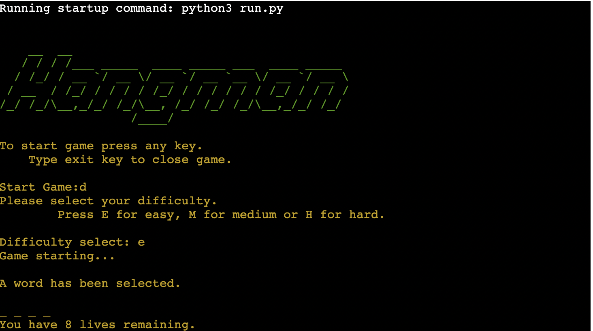
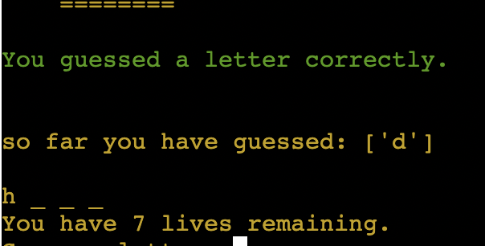
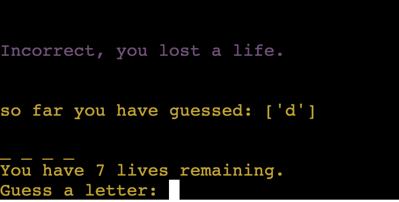
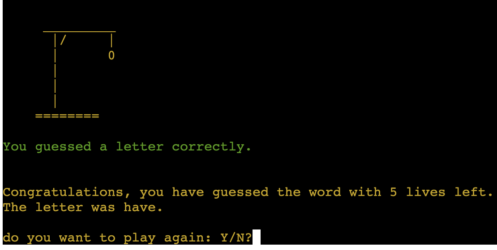
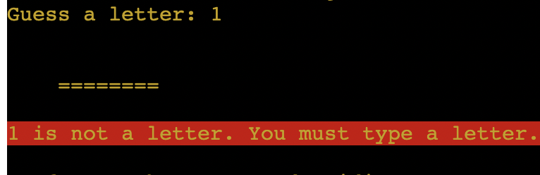
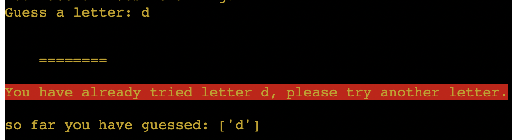
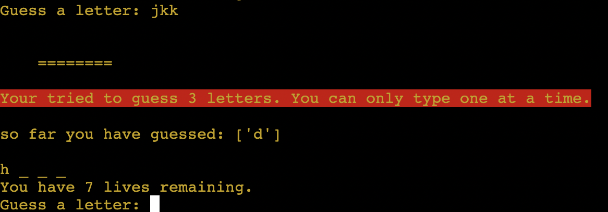

# Hangman

# Features

Error handling

## Features Left to Implement

Difficulty

# Testing

## Implementation

Error handling
Implementation: Tests for user input errors. \
Test: try game multiple times, trying capitol and lower case, symbols, numbers and multiple letters. \
Result: Caught all errors and passed correct inputs. \
Verdict: Success.

User experience
Implementation: Test quality of experience users have with game. \
Test: Users tested game, mostly none had experience with a comman line game. \
Result: Game worked but some found it wasn't always clear what was happening. \
Verdict: Works well but added color codes to success and errors and more spacing to improve ease of readability, re-wrote user feedback to be clearer. \

restart game
Implementation: 
Test: 
Result: 
Verdict: 

## Validator Testing

## bugs
Problem: When guessing a letter lives would be taken off depending on number of letters in word. This would happen even if one letter was guessed correctly \
Cause: Was checking each letter in word if it matched with the guess using 'for letter in word: if guess == letter:' \
Resolution: Change function to check if guess was in word rather than checked every letter

Problem: Lives would reach zero but still allow user to play. \
Cause: Code written to catch zero lives would only come into effect after -1 lives had already occured. \
Resolution: Moved break on zero lives after lives = play.lives inside main() function.

Problem: Letters would show in the order they were guesses when correct, not their actual place in the word. \
Cause: Did not have index for hidden word values. \
Resolution: used range() and len() to find index.

Problem: Sometimes extra '_' appears on the hidden word. \
Cause: If there is _ left at the end of a game they are added onto the next game's word. \
Resolution: Problem only occured when providing a fixed word to guess, which I did in testing, when I changed this to random each time as it should be the problem dissapeared.

## Unfixed Bugs

# Deployment

## Run locally
if you want to play this locally:
Cloning project and run locally
pip install colorama

copy clone link, go to terminal or commanand line of choice, have git installed and copy URL

when project runs 

pip install colorama 'pip install colorama'

python3 run.py

## Deploy to Herokou

typed pip3 freeze > requirements.txt to add files to requirements

# Credits

## Content

## Media