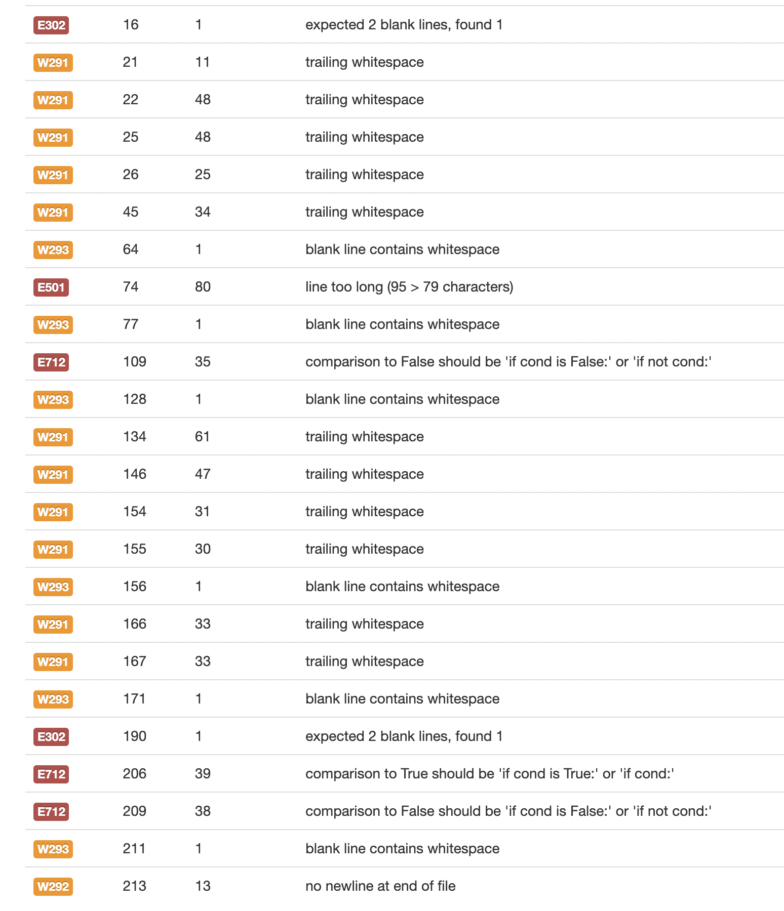

# Hangman
__________

# Features
Intialising screen

User guesses word correctly

User guesses the incorrect letter

User wins

## Error handling: 
User inputs something other than a letter

User inputs a letter that is already in use

User inputs multiple letters

## UX Design

Strategy
  - Who: Any ages, english speakers (could be adjusted for the future for other languages)
  - What: An interactive game of hangman
  - Where: To be played locally on git hub or command line, or deployed on Herokou
  - When: Free time at home, not very portable so restrictive of when it can be played
  - Why: Practicing spelling / learning English

Scope
 - content Requirement: An interactive game that takes user inputs, if word is guessed before the player's life runs out they win, else they loose.

Structure
 - Interactive Design: Take user inputs and respond accordingly, provide error feedback if incorrect inputs gives.

 - information architecture: Navigation prior to starting game and on win or lose, simple function so simple layout for readability.

Skeleton
 - Interface Design: Linear design as command line application, use of inputs and ASCII images for user to interact with.

 - Navigation design: There is an initialization screen that asks user if they want to start, user is then able to select difficulty level. User can decide if they with to continue game or exit on a win or a loss, this takes them back to difficulty select if they want to continue or to title screen if they wish to exit.

 - Information design: Clear spacing and use of color coded messages users can understand at a glance.

Surface
 - Sensory Design: Clear spacing for relevant information, give clear and concise feedback for user. Text art and possibly color.

Pre-production flow chart

## Data Model

I focused on using Object Oriented Programming in this project, this perhaps makes the project more complex than it needs to be however it will make it easier to maintain in the future. A class was used to create the bulk of the game with a few functions to interact with it. 

Also includes:
- Inputs
- Print statements
- for loops
- append

# Testing
## Implementation

Error Handling
Implementation: Tests for user input errors. \
Test: try game multiple times, trying capitol and lower case, symbols, numbers and multiple letters. \
Result: Caught all errors and passed correct inputs. \
Verdict: Success.

User Experience - Ease of Use
Implementation: Test quality of experience users have with game. \
Test: Users tested game, mostly none had experience with a comman line game. \
Result: Game worked but some found it wasn't always clear what was happening. \
Verdict: Worked ok but added color codes to success and errors and more spacing to improve ease of readability, tested again and found much better response from users. \

User experience - Navigation
Implementation: Test how users find navigating the app, difficulty select and exiting game. \
Test: Have users try multiple games, trying different difficulties and exiting with minimal assistance. \
Result: Users didn't like having to select difficulty every time they start a new game, otherwise easy to navigate app. \
Verdict: Overall not bad but the difficulty select could be moved to another section or bypassed on restart. \

## Validator Testing

Most of the issues with the validation were with the use of white space which I have not changes as I wanted to keep the project clear and readable, maximum of 1 space between lines. There were issues with using True / False statements however the code works so won't change this.

## bugs
Problem: When guessing a letter lives would be taken off depending on number of letters in word. This would happen even if one letter was guessed correctly. \
Cause: Was checking each letter in word if it matched with the guess using 'for letter in word: if guess == letter:'. \
Resolution: Change function to check if guess was in word rather than checked every letter.

Problem: Lives would reach zero but still allow user to play. \
Cause: Code written to catch zero lives would only come into effect after -1 lives had already occurred. \
Resolution: Moved break on zero lives after lives = play.lives inside main() function.

Problem: Letters would show in the order they were guesses when correct, not their actual place in the word. \
Cause: Did not have index for hidden word values. \
Resolution: used range() and len() to find index.

Problem: Sometimes extra '_' appears on the hidden word. \
Cause: If there is _ left at the end of a game they are added onto the next game's word. \
Resolution: Problem only occurred when providing a fixed word to guess, which I did in testing, when I changed this to random each time as it should be the problem disappeared.

Problem: When typing errors in difficulty select would cause correct inputs after to be incorrect. \
Cause: Problem was not present with only one word file, while loop causing it to not return correct data, try / except not catching errors.
Resolution: Returned invalid data to initial screen as could not find a solution - discussed below.

## Unfixed Bugs

There are no current errors that I could find testing incorrect values over and over. The set_word() function does not work how intended however. I would ideally have this only throw errors and loop through the input if the user types in the wrong data. I attempted both try / except and while loops - these methods worked to various degrees however they threw errors when users inputted correct data or broke on too many attempts of inputting the wrong data and then trying a correct one. Opted for this to take used back to initialization screen which is not ideal but works.

Prior to implementing more than one difficulty levels this was not an issue, this added complexity has made it more difficult to solve in a way that I want. I am certain there will be a way to use either try and except or while loop so these methods did partially work.

# Deployment

## Run locally
1.	 Add Github extension to browser.
2.	On the Github repository click Github extension button.
3.	Install colorama by typing  'pip install colorama' into terminal.
4.	Run program by typing ‘python3 run.py’ into terminal.

## Deploy to Heroku
1. Make sure you have the latest version of the app on github has been pushed, if the requirements folder is empty you can type 'typed pip3 freeze > requirements.txt' to automatically add files in Github terminal
2.	Create a Heroku account.
3.	Choose App name and region, the name must be unique.
4.	Click ‘Create App’.
5.	Adjust settings before deployment.
6.	Go to con fig vars, type PORT in key field, type 8000 in value field — click add.
7.	Add build packs, first select Python, save changes. Click nodejs and save, make sure python sits above nodejs — drag into correct order if this is wrong.
8.	Go to deploy section, select github to connect – you then need to type in the github repository name.
9.	Click automatic deploy or manual deploy, automatic will be best if you plan on making any changes to the repository as it automatically updates Heroku.
10.	Wait for deployment link to generage – a view button will appear.

# Credits, content and media

Code Insitute for deployment terminal

Referenced these youtube tutorials to get an understanding of different aproaches to building Hangman
https://www.youtube.com/watch?v=m4nEnsavl6w&ab_channel=Kite
https://www.youtube.com/watch?v=cJJTnI22IF8&t=315s&ab_channel=KylieYing
https://www.youtube.com/watch?v=GxpwA4_4Gww&list=FLeOJ7bi8jwNWMEmcYKr98Qg&index=1&ab_channel=sethmcfeeters

Stackoverflow - frequently reference when issues arose

https://app.diagrams.net/ - used to create flow chart to plan design
https://patorjk.com/software/taag/#p=display&f=Small&t=Type%20Something%20 - for the handman text art

There are no media files other than images in the read me