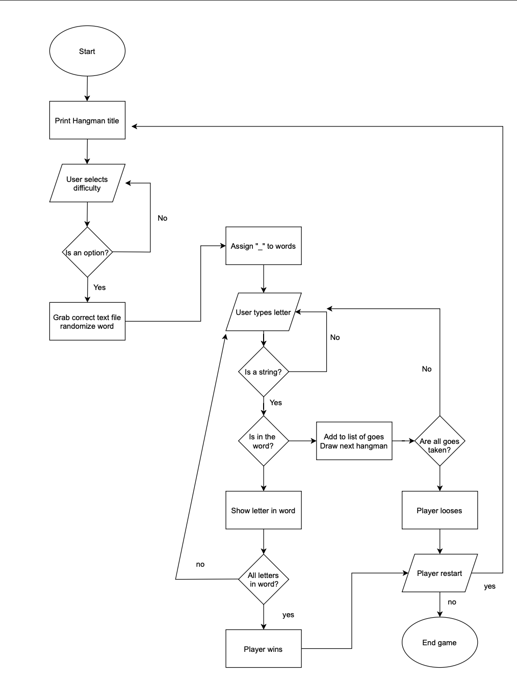

# Hangman

# Features
## Intialising screen

## User guesses word correctly

## User guesses the incorrect letter

## User wins

Error handling: 
## User inputs something other than a letter

## User inputs a letter that is already in use

## User inputs multiple letters

## UX Design

Strategy
  - who: Any ages, english speakers (could be adjusted for the future for other languages)
  - what: An interactive game of hangman
  - where: To be played locally on git hub or command line, or deployed on Herokou
  - when: Free time at home, not very portable so restrictive of when it can be played
  - why: Practicing spelling / learning English

Scope
 - content Requirement: An interactive game that takes user inputs, if word is guessed before the players life runs out they win, else they loose.

Structure
 - Interactive Design: Take user inputs and respond accordingly, provide error feedback if incorrect inputs gives

 - information architecture: 

Skeleton
 - Interface Design: 

 - Navigation design: User can decide if they with to continue game or exit on a win or a loss. No other navigation is required.

 - Information design: 

Surface
 - Sensory Design: Clear spacing for relevant information, give clear and concice feedback for user. Text art and possibly color.

## Features Left to Implement

Difficulty
In future I would look to impliment a difficulty setting, before the game initialised I would take a user input to select 'E' for easy, 'M' for Medium and 'H' for hard, each would run a function that changes the value of the word file.

# Testing
## Implementation

Error handling
Implementation: Tests for user input errors. \
Test: try game multiple times, trying capitol and lower case, symbols, numbers and multiple letters. \
Result: Caught all errors and passed correct inputs. \
Verdict: Success.

User experience
Implementation: Test quality of experience users have with game. \
Test: Users tested game, mostly none had experience with a comman line game. \
Result: Game worked but some found it wasn't always clear what was happening. \
Verdict: Works well but added color codes to success and errors and more spacing to improve ease of readability, re-wrote user feedback to be clearer. \

## Validator Testing

## bugs
Problem: When guessing a letter lives would be taken off depending on number of letters in word. This would happen even if one letter was guessed correctly \
Cause: Was checking each letter in word if it matched with the guess using 'for letter in word: if guess == letter:' \
Resolution: Change function to check if guess was in word rather than checked every letter

Problem: Lives would reach zero but still allow user to play. \
Cause: Code written to catch zero lives would only come into effect after -1 lives had already occured. \
Resolution: Moved break on zero lives after lives = play.lives inside main() function.

Problem: Letters would show in the order they were guesses when correct, not their actual place in the word. \
Cause: Did not have index for hidden word values. \
Resolution: used range() and len() to find index.

Problem: Sometimes extra '_' appears on the hidden word. \
Cause: If there is _ left at the end of a game they are added onto the next game's word. \
Resolution: Problem only occured when providing a fixed word to guess, which I did in testing, when I changed this to random each time as it should be the problem dissapeared.

## Unfixed Bugs

# Deployment

## Run locally
1.	 Add Github extension to browser.
2.	On the Github repository click Github extension button.
3.	Install colorama by typing  'pip install colorama' into terminal.
4.	Run program by typing ‘python3 run.py’ into terminal.

## Deploy to Herokou
1. Make sure you have the latest version of the app on github has been pushed, if the requirements folder is empy you can type 'typed pip3 freeze > requirements.txt' to atomatically add files in Github terminal
2.	Create a Herokou account.
3.	Choose App name and region, the name must be unique.
4.	Click ‘Create App’.
5.	Adjust settings before deployment.
6.	Go to config vars,  type PORT in key field, type 8000 in value field – click add.
7.	Add buildbacks, first select Python, save changes. Click nodejs and save, make sure python sits above nodejs – drag into correct order if this is wrong.
8.	Go to deploy section, select github to connect – you then need to type in the github repository name.
9.	Click automatic deploy or manual deploy, automatic will be best if you plan on making any changes to the repository as it automatically updates Herokou.
10.	Wait for deployment link to generage – a view button will appear.

# Credits, content and media
Referenced these youtube tutorials to get an understanding of different aproaches to building Hangman
https://www.youtube.com/watch?v=m4nEnsavl6w&ab_channel=Kite
https://www.youtube.com/watch?v=cJJTnI22IF8&t=315s&ab_channel=KylieYing
https://www.youtube.com/watch?v=GxpwA4_4Gww&list=FLeOJ7bi8jwNWMEmcYKr98Qg&index=1&ab_channel=sethmcfeeters

Stackoverflow - frequently reference when issues arose

https://app.diagrams.net/ - used to create flow chart to plan design
https://patorjk.com/software/taag/#p=display&f=Small&t=Type%20Something%20 - for the handman text art

There are no media files other than images in the read me